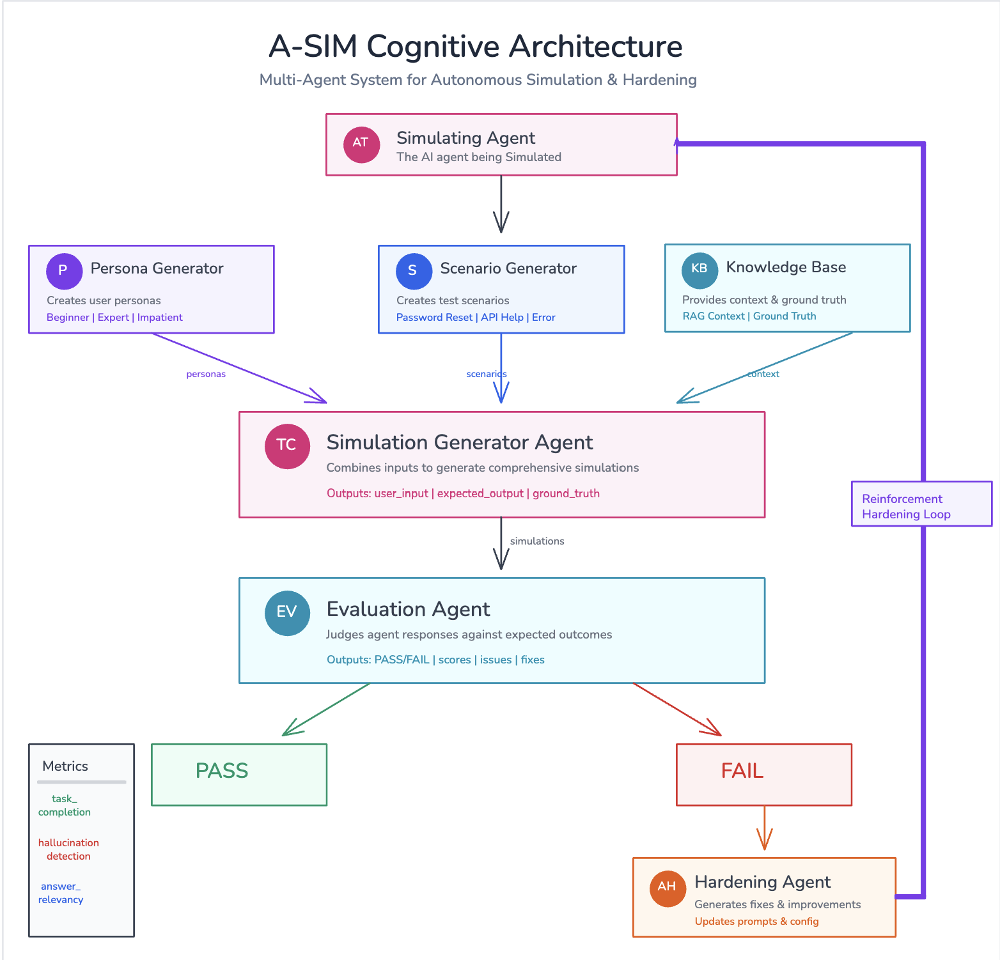
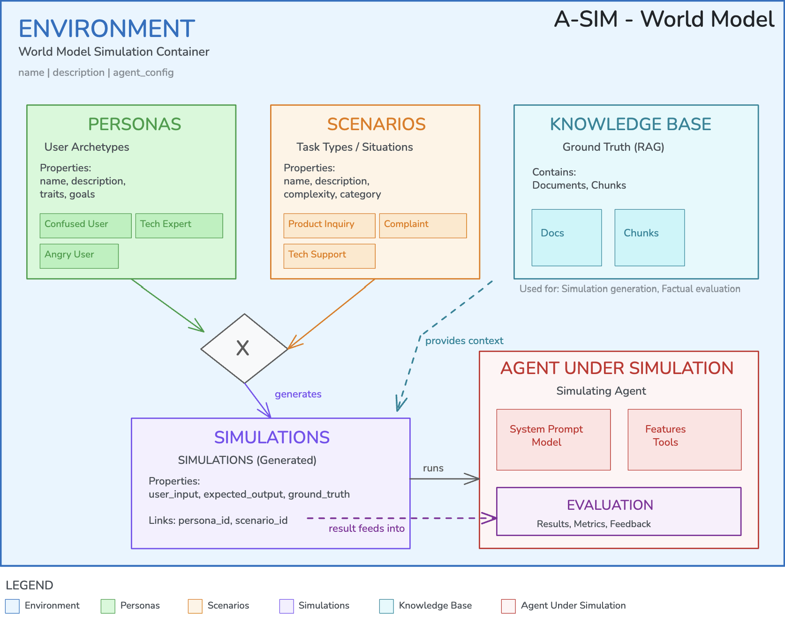
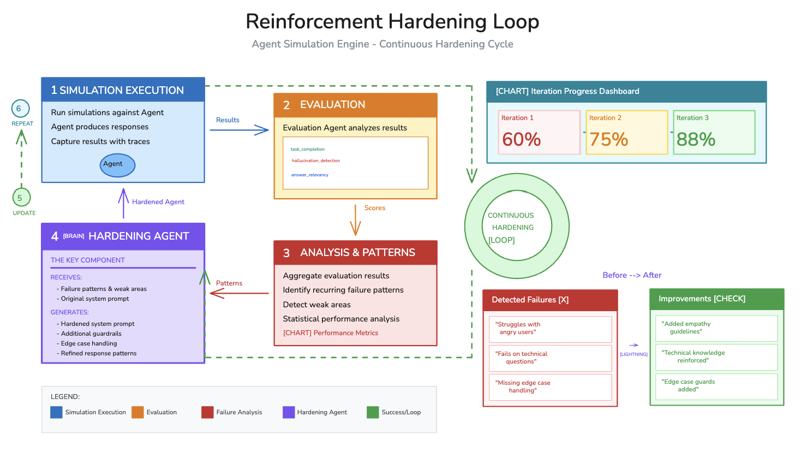

<p align="center">
  
</p>

<h1 align="center">Agent Simulation Engine SDK</h1>

<p align="center">
  <strong>Official Python SDK for the Lyzr Agent Simulation Engine (A-Sim) Platform</strong>
</p>

<p align="center">
  <a href="https://github.com/LyzrCore/agent-simulation-engine/blob/main/LICENSE">
    
  </a>
  <a href="https://www.python.org/downloads/">
    
  </a>
  <a href="https://github.com/LyzrCore/agent-simulation-engine">
    
  </a>
  <a href="https://docs.lyzr.ai">
    
  </a>
</p>

<p align="center">
  <a href="#-installation">Installation</a> •
  <a href="#-quick-start">Quick Start</a> •
  <a href="#-features">Features</a> •
  <a href="#-api-reference">API Reference</a> •
  <a href="#-examples">Examples</a>
</p>

---

## Overview

The **Agent Simulation Engine (A-Sim)** SDK enables you to programmatically test, evaluate, and improve your AI agents through automated simulation and reinforcement learning loops.

### What is A-Sim?

A-Sim is a comprehensive platform for:

| Feature | Description |
|---------|-------------|
| **Automated Testing** | Generate realistic test cases from persona × scenario combinations |
| **AI Evaluation** | Evaluate agent responses on accuracy, helpfulness, safety & more |
| **RL Hardening** | Continuously improve agents through reinforcement learning loops |
| **Ground Truth Validation** | Validate responses against knowledge base facts |

---




## How to Run

### Step 1: Install the SDK

```bash
pip install git+https://github.com/LyzrCore/agent-simulation-engine.git#subdirectory=sdk
```

### Step 2: Get Your API Key

Get your `studio-api-key` from [Lyzr Studio](https://studio.lyzr.ai)

### Step 3: Run Complete Workflow

```python
from agent_simulation_engine import ASIMEngine
import time

# ============================================
# STEP 1: Initialize Engine
# ============================================
engine = ASIMEngine(api_key="your-studio-api-key")

# ============================================
# STEP 2: Create Environment
# ============================================
env = engine.environments.create(
    agent_id="your-agent-id",  # From Lyzr Studio
    name="My Agent Tests"
)
print(f"✓ Environment created: {env.environment_id}")

# ============================================
# STEP 3: Generate Personas & Scenarios
# ============================================
personas = engine.personas.generate(env.environment_id)
print(f"✓ Generated {personas.count} personas")

scenarios = engine.scenarios.generate(env.environment_id)
print(f"✓ Generated {scenarios.count} scenarios")

# ============================================
# STEP 4: Generate Simulations (Test Cases)
# ============================================
job = engine.simulations.generate(env.environment_id)
print(f"✓ Simulation job started: {job.job_id}")

# Wait for completion
while True:
    status = engine.jobs.get_status(env.environment_id, job.job_id)
    print(f"  Progress: {status.progress}")
    if status.summary.completed + status.summary.failed == status.summary.total:
        break
    time.sleep(3)
print(f"✓ Simulations generated!")

# ============================================
# STEP 5: Run Evaluations
# ============================================
eval_run = engine.evaluations.create(
    environment_id=env.environment_id,
    evaluation_run_name="Round 1"
)
print(f"✓ Evaluation started: {eval_run.evaluation_run_id}")

# Wait for completion
while True:
    status = engine.jobs.get_evaluation_status(env.environment_id, eval_run.job_id)
    print(f"  Progress: {status.progress}")
    if status.summary.completed + status.summary.failed == status.summary.total:
        break
    time.sleep(3)

# ============================================
# STEP 6: View Results
# ============================================
results = engine.evaluations.list(env.environment_id)
pass_count = sum(1 for e in results.evaluations if e.judgment == "PASS")
fail_count = sum(1 for e in results.evaluations if e.judgment == "FAIL")
print(f"\n📊 Results: {pass_count} PASS | {fail_count} FAIL")

# ============================================
# STEP 7: Harden Agent (if needed)
# ============================================
if fail_count > 0:
    hardening = engine.hardening.harden_agent(
        environment_id=env.environment_id,
        run_id=eval_run.evaluation_run_id,
        round_number=1
    )
    print(f"\n🔧 Agent Hardened!")
    print(f"  Original: {hardening.original_config.agent_instructions[:100]}...")
    print(f"  Improved: {hardening.improved_config.agent_instructions[:100]}...")
```

### Step 4: Run It!

```bash
python your_script.py
```

---


## Installation

### From GitHub (Recommended)

```bash
pip install git+https://github.com/LyzrCore/agent-simulation-engine.git#subdirectory=sdk
```

### From Source

```bash
git clone https://github.com/LyzrCore/agent-simulation-engine.git
cd agent-simulation-engine/sdk
pip install -e .
```

### Requirements

- Python 3.8+
- `requests >= 2.28.0`
- `pydantic >= 2.0.0`

---

## Quick Start

```python
from agent_simulation_engine import ASIMEngine
import time

# Initialize the engine
engine = ASIMEngine(api_key="studio-api-key")

# Create an environment for your agent
env = engine.environments.create(
    agent_id="studio-agent-key",
    name="Customer Support Tests"
)

# Generate personas and scenarios using AI
personas = engine.personas.generate(env.environment_id)
scenarios = engine.scenarios.generate(env.environment_id)

# Generate test simulations
job = engine.simulations.generate(env.environment_id)

# Poll until complete
while True:
    status = engine.jobs.get_status(env.environment_id, job.job_id)
    if status.summary.completed + status.summary.failed == status.summary.total:
        break
    time.sleep(2)

# Run evaluations
eval_run = engine.evaluations.create(
    environment_id=env.environment_id,
    evaluation_run_name="Round 1"
)

print(f"Evaluation started: {eval_run.evaluation_run_id}")
```

---

## Features

### World Model Architecture

### Reinforcement Hardening Loop

```python
# 1. Run initial evaluations
eval_run = engine.evaluations.create(env_id, "Round 1")

# 2. Wait for completion, then harden
hardening = engine.hardening.harden_agent(
    environment_id=env_id,
    run_id=eval_run.evaluation_run_id,
    round_number=1
)

# 3. View improvements
print("Original:", hardening.original_config.agent_instructions)
print("Improved:", hardening.improved_config.agent_instructions)

# 4. Continue with improved agent
new_round = engine.hardening.continue_run(
    environment_id=env_id,
    run_id=eval_run.evaluation_run_id,
    round_number=1,
    agent_config=hardening.improved_config.model_dump()
)

# 5. Repeat until all tests pass!
```



---

## API Reference

### Initialization

```python
from agent_simulation_engine import ASIMEngine

engine = ASIMEngine(
    api_key="studio-api-key",                    # Required
    base_url="https://agent.api.lyzr.ai",      # Optional
    timeout=30                                  # Optional (seconds)
)
```

### Resources

| Resource | Description | Methods |
|----------|-------------|---------|
| `engine.environments` | Manage test environments | `create()`, `get()`, `list_by_agent()`, `delete()` |
| `engine.personas` | User archetypes | `create()`, `list()`, `generate()`, `delete()` |
| `engine.scenarios` | Task types | `create()`, `list()`, `generate()`, `delete()` |
| `engine.simulations` | Test cases | `create()`, `list()`, `get()`, `update()`, `delete()`, `generate()` |
| `engine.evaluations` | Run evaluations | `create()`, `list()`, `get()` |
| `engine.jobs` | Track async jobs | `get_status()`, `list()`, `cancel()`, `get_evaluation_status()` |
| `engine.evaluation_runs` | RL training rounds | `get()`, `list()`, `get_round()`, `sync_round()` |
| `engine.hardening` | Improve agents | `harden_agent()`, `continue_run()` |

---

## Examples

### Create Environment & Generate Test Data

```python
# Create environment
env = engine.environments.create(
    agent_id="studio-agent-key",
    name="Product Support Tests"
)

# Add personas manually
personas = engine.personas.create(env.environment_id, personas=[
    {"name": "New Customer", "description": "First-time user, unfamiliar with product"},
    {"name": "Power User", "description": "Experienced user with technical knowledge"},
    {"name": "Frustrated Customer", "description": "User experiencing issues, potentially angry"},
])

# Or generate with AI
personas = engine.personas.generate(env.environment_id)
scenarios = engine.scenarios.generate(env.environment_id)
```

### Run Evaluations

```python
# Start evaluation run
eval_run = engine.evaluations.create(
    environment_id=env.environment_id,
    evaluation_run_name="Initial Assessment",
    metrics=["task_completion", "hallucinations", "answer_relevancy"]
)

# Poll for completion
while True:
    status = engine.jobs.get_evaluation_status(env.environment_id, eval_run.job_id)
    print(f"Progress: {status.progress}")

    if status.summary.completed + status.summary.failed == status.summary.total:
        break
    time.sleep(2)

# Get results
results = engine.evaluations.list(env.environment_id)
for eval in results.evaluations:
    print(f"{eval.id}: {eval.judgment} - {eval.scores}")
```

---

## Error Handling

The SDK provides specific exception types for different error scenarios:

```python
from agent_simulation_engine import (
    ASIMEngine,
    ASIMError,
    AuthenticationError,
    NotFoundError,
    ValidationError,
    RateLimitError,
    ServerError,
)

engine = ASIMEngine(api_key="studio-api-key")

try:
    env = engine.environments.get("invalid-id")
except AuthenticationError:
    print("Invalid API key")
except NotFoundError:
    print("Environment not found")
except ValidationError as e:
    print(f"Invalid request: {e.message}")
except RateLimitError:
    print("Rate limit exceeded, please retry later")
except ServerError:
    print("Server error, please try again")
except ASIMError as e:
    print(f"API error: {e.message} (status: {e.status_code})")
```

---

## Support

| Resource | Link |
|----------|------|
| GitHub Issues | [Report a Bug](https://github.com/LyzrCore/agent-simulation-engine/issues) |
---

<p align="center">
  <strong>Built with by <a href="https://lyzr.ai">Lyzr AI</a></strong>
</p>

<p align="center">
  <a href="https://lyzr.ai">Website</a> •
  <a href="https://x.com/lyzr__ai">Twitter</a> •
  <a href="https://www.linkedin.com/company/lyzr-platform">LinkedIn</a>
</p>
