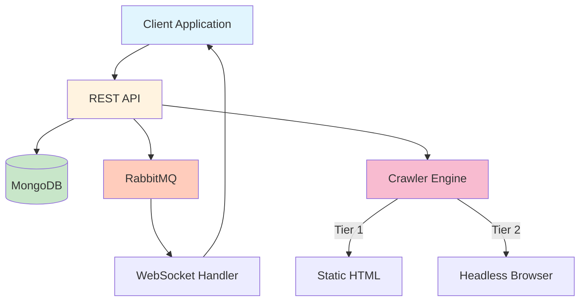

# 🕷️ Lyzr Crawl

<div align="center">

[](https://opensource.org/licenses/MIT)
[](https://go.dev/)
[](https://www.docker.com/)
[](https://www.mongodb.com/)
[](https://www.rabbitmq.com/)

**A high-performance web crawler API built with Go**  
Extract content, discover URLs, and crawl websites at scale with real-time progress updates

[Features](#-features) • [Quick Start](#-quick-start) • [API](#-api-documentation) • [Examples](#-examples) • [Contributing](#-contributing)

</div>

---

## ✨ Features

<table>
<tr>
<td>

### 🚀 Performance
- **Concurrent crawling** with configurable workers
- **MongoDB storage** for persistent job tracking
- **Smart rate limiting** to respect server resources
- **Automatic retries** with exponential backoff

</td>
<td>

### 🎯 Capabilities
- **Multi-format extraction**: HTML, Markdown, Clean Text
- **JavaScript rendering** via headless Chrome/Firefox
- **Robots.txt compliance** with configurable override
- **Pattern-based filtering** for URLs

</td>
</tr>
<tr>
<td>

### 📊 Real-time Monitoring
- **WebSocket live updates** for crawl progress
- **Detailed job tracking** with statistics
- **Progress tracking** with completion percentages
- **RESTful API** with Swagger documentation

</td>
<td>

### 🔒 Security & Reliability
- **API key authentication** for access control
- **Domain restrictions** to prevent abuse
- **Request timeouts** and circuit breakers
- **Graceful error handling** and recovery

</td>
</tr>
</table>

## 🚀 Quick Start

### 🐳 Using Docker (Recommended)

```bash
# 1. Clone the repository
git clone https://github.com/LyzrCore/lyzr-crawl.git
cd lyzr-crawl

# 2. Set up environment
cp .env.example .env
# Edit .env with your MongoDB connection string

# 3. Start the crawler
docker-compose up -d

# 4. Check health
curl http://localhost:8080/health
```

### 💻 Local Development

<details>
<summary>Click to expand local setup instructions</summary>

```bash
# Prerequisites: Go 1.21+, MongoDB, RabbitMQ (optional)

# Install dependencies
go mod download

# Run with custom configuration
go run . \
  -mongo-uri="mongodb://localhost:27017/crawler" \
  -rabbitmq-url="amqp://localhost:5672/" \
  -port=8080

# Build binary
go build -o crawler .
./crawler
```

</details>

## 📖 API Documentation

### 🔑 Authentication

All API endpoints require authentication:

```bash
# Using header
curl -H "X-API-Key: your-api-key-here" http://localhost:8080/api/...

# Using Bearer token
curl -H "Authorization: Bearer your-api-key-here" http://localhost:8080/api/...
```

### 📍 Endpoints

| Method | Endpoint | Description |
|--------|----------|-------------|
| `GET` | `/health` | Health check with system status |
| `POST` | `/crawl` | Start a new crawl job |
| `POST` | `/content` | Extract content from URLs |
| `GET` | `/jobs` | List all crawl jobs |
| `GET` | `/jobs/{id}` | Get specific job details |
| `WS` | `/ws/{id}` | WebSocket for live updates |
| `GET` | `/notforhumans/` | Swagger UI documentation |

## 📝 Examples

### Start a Basic Crawl

```bash
curl -X POST http://localhost:8080/crawl \
  -H "X-API-Key: your-api-key-here" \
  -H "Content-Type: application/json" \
  -d '{
    "url": "https://example.com",
    "max_pages": 50,
    "max_depth": 2
  }'
```

<details>
<summary>📋 View full crawl options</summary>

```json
{
  "url": "https://example.com",
  "max_pages": 100,
  "max_depth": 3,
  "allowed_domains": ["example.com", "blog.example.com"],
  "exclude_patterns": ["/admin", "/private"],
  "include_patterns": ["/blog", "/docs"],
  "respect_robots_txt": true,
  "crawl_delay": 1000,
  "timeout": 30,
  "max_concurrent": 5,
  "user_agent": "MyBot/1.0"
}
```

</details>

### Extract Content from Multiple URLs

```bash
curl -X POST http://localhost:8080/content \
  -H "X-API-Key: your-api-key-here" \
  -H "Content-Type: application/json" \
  -d '{
    "urls": [
      "https://example.com/page1",
      "https://example.com/page2"
    ],
    "concurrency": 50
  }'
```

### Monitor Progress with WebSocket

```javascript
const ws = new WebSocket('ws://localhost:8080/ws/job-id-here');

ws.onmessage = (event) => {
  const update = JSON.parse(event.data);
  console.log(`Progress: ${update.progress}%`);
  console.log(`URLs found: ${update.urls_found}`);
};
```

## 🏗️ Architecture



## ⚙️ Configuration

### Environment Variables

```bash
# Core Configuration
MONGO_URI=mongodb://localhost:27017/crawler  # MongoDB connection
RABBITMQ_URL=amqp://localhost:5672/         # RabbitMQ (optional)
API_KEY=your-secure-api-key                  # API authentication
PORT=8080                                    # Server port
GIN_MODE=release                            # Framework mode

# Optional Services
SCRAPEOPS_API_KEY=your-key                  # Proxy rotation service
```

### Crawl Parameters

| Parameter | Type | Default | Description |
|-----------|------|---------|-------------|
| `max_pages` | int | 50 | Maximum pages to crawl |
| `max_depth` | int | 3 | Maximum crawl depth |
| `crawl_delay` | int | 1000 | Delay between requests (ms) |
| `timeout` | int | 30 | Request timeout (seconds) |
| `max_concurrent` | int | 5 | Concurrent requests |
| `respect_robots_txt` | bool | true | Follow robots.txt rules |

## 🛠️ Development

### Project Structure

```
lyzr-crawl/
├── config/              # Configuration files
│   ├── database.go     # Database config
│   ├── rabbitmq.go     # RabbitMQ config
│   └── scrapeops.go    # ScrapeOps integration
├── handlers/            # HTTP request handlers
│   ├── content.go      # Content extraction endpoints
│   ├── crawl.go        # Crawl job management
│   ├── health.go       # Health check endpoints
│   ├── jobs.go         # Job listing and status
│   └── websocket.go    # WebSocket connections
├── services/            # Core business logic
│   ├── crawler.go      # Main crawling engine
│   ├── database.go     # MongoDB operations
│   ├── messaging.go    # RabbitMQ messaging
│   ├── robots.go       # Robots.txt parser
│   ├── sitemap.go      # Sitemap parser
│   └── stealth.go      # Anti-detection features
├── models/              # Data structures
│   ├── content.go      # Content response models
│   ├── crawl.go        # Crawl request/response
│   ├── events.go       # Event models
│   ├── job.go          # Job tracking models
│   └── sitemap.go      # Sitemap models
├── middleware/          # HTTP middleware
│   ├── auth.go         # API key authentication
│   └── logging.go      # Request logging
├── utils/               # Helper functions
│   └── url.go          # URL utilities
├── docs/                # API documentation
│   ├── docs.go         # Generated docs
│   ├── swagger.json    # Swagger spec
│   └── swagger.yaml    # Swagger spec
├── ui/                  # Web UI assets
│   └── index.html      # Simple web interface
├── main.go              # Application entry point
├── server.go            # HTTP server setup
├── docker-compose.yml   # Docker composition
├── Dockerfile           # Container definition
└── README.md            # This file
```

## 🤝 Contributing

We love contributions! Please see our [Contributing Guide](CONTRIBUTING.md) for details.

### Quick Contribution Guide

1. Fork the repository
2. Create your feature branch (`git checkout -b feature/AmazingFeature`)
3. Make your changes
4. Test your changes locally
5. Commit your changes (`git commit -m 'Add some AmazingFeature'`)
6. Push to the branch (`git push origin feature/AmazingFeature`)
7. Open a Pull Request

### Development Setup

```bash
# Install dependencies
go mod download

# Build the project
go build -o lyzr-crawl .

# Run locally
./lyzr-crawl -mongo-uri="mongodb://localhost:27017/crawler"

# Generate Swagger docs
swag init -g server.go
```

## 📊 Performance Benchmarks

### Lyzr Crawl Performance

| Scenario | Requests/sec | Pages/min | Success Rate |
|----------|--------------|-----------|--------------|
| Light Load (5 concurrent) | ~8 req/sec | ~480 pages/min | 95%+ |
| Medium Load (25 concurrent) | ~25 req/sec | ~1,500 pages/min | 94%+ |
| Heavy Load (50 concurrent) | ~40 req/sec | ~2,400 pages/min | 92%+ |
| Stress Test (100 concurrent) | ~60 req/sec | ~3,600 pages/min | 89%+ |
 
 
### Benchmark Notes

- **JavaScript rendering**: Adds ~50-100ms overhead per page

## 🐛 Troubleshooting

<details>
<summary>Common issues and solutions</summary>

### MongoDB Connection Failed
```bash
# Check if MongoDB is running
docker-compose ps

# Verify connection string
echo $MONGO_URI

# Test connection
mongosh "$MONGO_URI"
```

### WebSocket Not Connecting
- Ensure RabbitMQ is running
- Check CORS settings if connecting from browser
- Verify job ID is valid

### High Memory Usage
- Reduce `max_concurrent` setting
- Lower `max_pages` limit
- Enable swap if needed

</details>

## 📄 License

This project is licensed under the MIT License - see the [LICENSE](LICENSE) file for details.

## 🙏 Acknowledgments

Built with these amazing tools:
- [Go](https://golang.org/) - The programming language
- [Rod](https://github.com/go-rod/rod) - Browser automation
- [Gorilla Mux](https://github.com/gorilla/mux) - HTTP router
- [MongoDB](https://www.mongodb.com/) - Database
- [RabbitMQ](https://www.rabbitmq.com/) - Message broker (optional)

---

<div align="center">

**Lyzr Crawl** - Part of the [Lyzr.ai](https://www.lyzr.ai) ecosystem

[Report Bug](https://github.com/LyzrCore/lyzr-crawl/issues) • [Request Feature](https://github.com/LyzrCore/lyzr-crawl/issues)

</div>